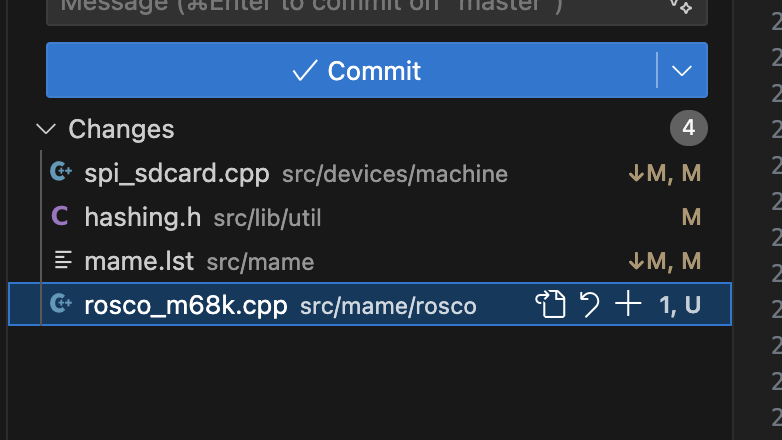
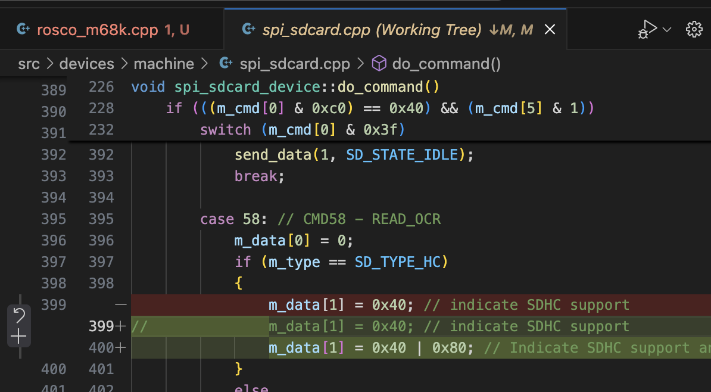
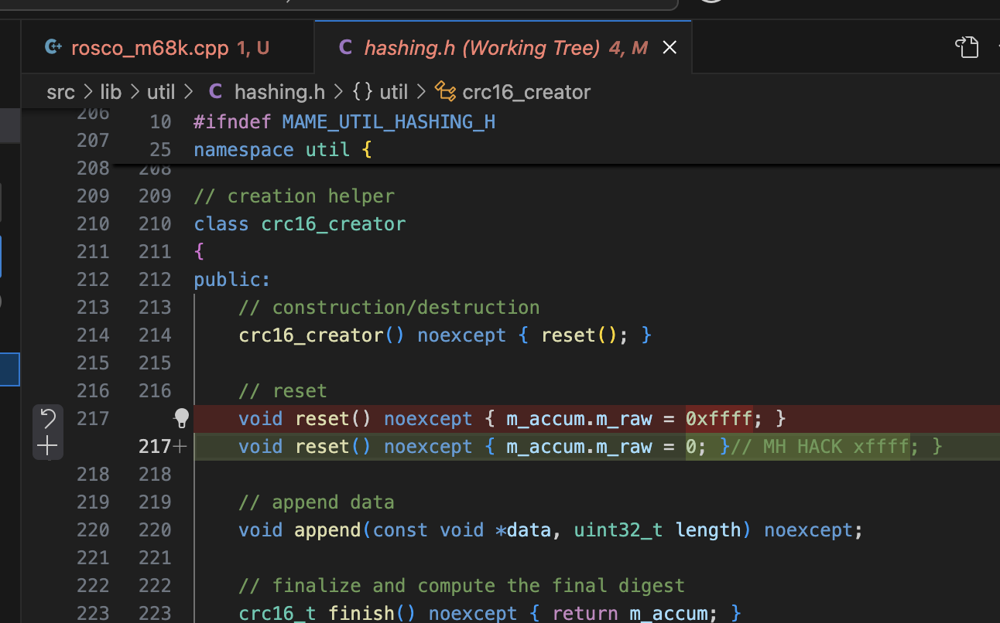
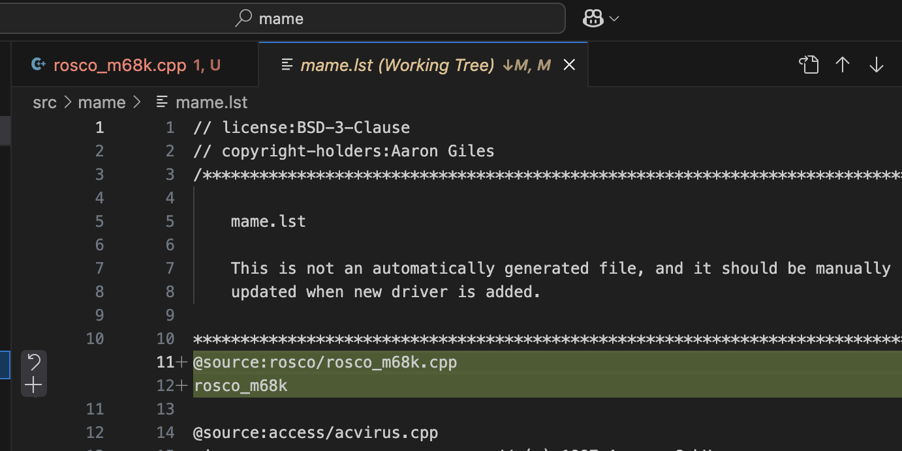

# rosco_mame
The files needed to get mame running to simulate a rosco_m68k SBC.

The full mame repo is very large .. this just documents the few files necessary to get mame up and running.

The main source file change is a new machine definition that can be found in the src directory.  The other three changes are trivial and captured by screen shots.  

Note that the SD Card functionality is not working.  

